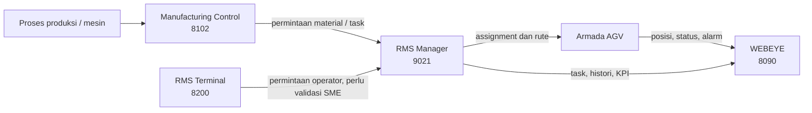
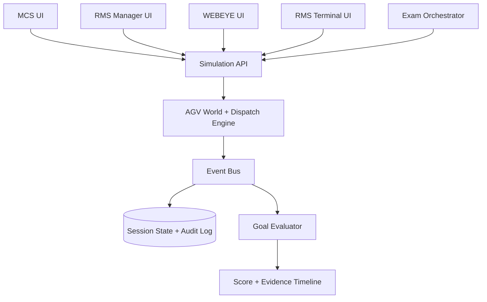

# Rencana Sistem Simulasi Lab Ujian AGV/RMS

## 1. Tujuan

Membangun lab ujian yang sepenuhnya terpisah dari produksi untuk menilai kemampuan praktik staf baru dalam mengoperasikan dan menangani sistem AGV. Peserta menerima sebuah perintah berbasis goal, lalu dinilai dari keadaan akhir simulasi, ketepatan proses, keselamatan, waktu, dan kemampuan menangani gangguan.

Contoh goal: "Pastikan material LOT-A dipindahkan dari ST-01 ke ST-08 menggunakan robot yang layak, lalu buktikan task selesai tanpa alarm aktif."

Sistem ujian tidak boleh terhubung ke endpoint produksi, robot fisik, PLC, OPC UA produksi, maupun database produksi.

## 2. Temuan dari aplikasi produksi

Analisis dilakukan pada 10 September 2026 dengan HTTP GET/HEAD saja. Tidak ada login, klik kontrol, pengiriman form, perubahan konfigurasi, atau pemanggilan endpoint aksi.

### 2.1 Manufacturing Control — `10.201.255.5:8102`

Fakta yang teramati:

- Aplikasi web berbasis Umi dengan konfigurasi menuju layanan MCS di port 5010.
- Memiliki koneksi yang dikonfigurasi untuk OPC UA di port 5001, OPC UA/EAP di port 5150, dan portal di port 8100.
- Konfigurasi frontend memuat kemampuan penghapusan task, dialog konfirmasi, dan forced logout.
- Judul tab pada tangkapan layar menunjukkan "junion - Manufacturing Control System".

Interpretasi untuk proses AGV:

- Berperan sebagai lapisan kontrol manufaktur yang menerima kebutuhan produksi/peralatan dan mengubahnya menjadi permintaan atau task material handling.
- Menjadi penghubung antara proses mesin/EAP/OPC UA dan lapisan pengelolaan robot.
- Kemungkinan menjadi tempat memantau atau mengelola lifecycle perintah produksi sebelum atau selama diteruskan ke RMS.

Batas kepastian: detail menu dan alur task belum diverifikasi karena bundle aplikasi sangat besar dan menjalankan aplikasinya dapat memicu request dinamis ke layanan produksi. Rancangan ujian harus menganggap rincian ini sebagai hipotesis sampai divalidasi oleh subject-matter expert (SME).

### 2.2 RMS Manager — `10.201.255.2:9021/view/index.html`

Fakta yang teramati:

- Menampilkan current jobs, status robot, job failure tree/list, job flow, job statistics, robot statistics, in-transit jobs, energi, exception, target control status, distribusi waktu task, produktivitas, timeout, alasan robot offline, charging-dock statistics, buffer, dan throughput.
- Memiliki konfigurasi zone, resource, robot, parameter assignment/path, binding titik, peta, aturan transport, CT, jam kerja, buffer, resource group, cross-zone resource, user, dan layanan redundant.
- Current-job view dapat mencari berdasarkan robot, target/resource, job ID, dan status assignment.
- Data task mencakup zone, task ID, sumber material, robot, target/mesin, status, tipe, rute, serta waktu create/assign/start/end.
- Terdapat kemampuan force-close/cancel task. Ini adalah aksi operasional berisiko dan tidak digunakan selama observasi.

Interpretasi untuk proses AGV:

- Merupakan pusat pengelolaan armada dan task: assignment, routing, resource/zone, histori, exception, serta KPI.
- Cocok menjadi sumber kebenaran utama untuk lifecycle task dan kondisi armada dalam simulasi ujian.

### 2.3 WEBEYE — `10.201.255.1:8090`

Fakta yang teramati:

- Menampilkan robot di atas peta dan memperbarui posisi secara periodik.
- Mengelompokkan kondisi charging, emergency stop, task failed, lost/manual, stopped, carrying payload, offline, idle, low battery, low speed, payload timeout/abnormal, dan dock emergency stop.
- Dapat menampilkan/menyembunyikan alarm, peta, target, dan area; dapat mengubah zoom, posisi, dan rotasi tampilan.
- Tombol Start dan Stop pada kode halaman memulai atau menghentikan polling tampilan posisi robot. Dalam konteks halaman ini, keduanya mengatur live display, bukan start/stop gerakan robot.
- Payload mengatur cara informasi payload ditampilkan/diwarnai pada visualisasi.

Interpretasi untuk proses AGV:

- Merupakan dashboard situasional untuk melihat lokasi, arah, payload, status, dan alarm armada secara cepat.
- Cocok untuk soal identifikasi kondisi dan triage, tetapi bukan sumber tunggal untuk memutuskan tindakan korektif.

### 2.4 RMS Terminal — `10.201.255.1:8200/main`

Fakta yang teramati:

- Pengguna tanpa sesi diarahkan ke halaman login bernama `RMS终端` atau RMS Terminal.
- Memerlukan autentikasi sebelum halaman utama dapat dibuka.

Interpretasi untuk proses AGV:

- Kemungkinan merupakan antarmuka operator untuk membuat atau menjalankan permintaan operasional yang diteruskan ke RMS.
- Peran, menu, dan aksi setelah login belum diverifikasi dan tidak boleh dijadikan materi ujian final sebelum walkthrough aman dari SME.

### 2.5 Model hubungan sementara



Diagram tersebut adalah model kerja untuk simulasi, bukan dokumentasi resmi vendor. Arah integrasi terminal dan detail handoff MCS–RMS harus divalidasi.

## 2.6 Catatan UI/UX sebagai acuan simulator

Catatan ini membedakan elemen yang sudah terlihat dari elemen yang masih perlu diperagakan. Simulator harus mempertahankan pola kerja yang familiar bagi peserta, tetapi tetap memakai identitas visual `SIMULATION` agar tidak tertukar dengan produksi.

### Manufacturing Control — port 8102

Yang sudah terlihat:

- Aplikasi dibuka di browser dan menggunakan layout aplikasi web desktop.
- Judul tab menunjukkan `junion - Manufacturing Control System`.
- Frontend berupa single-page application; perpindahan halaman kemungkinan terjadi tanpa reload penuh.
- Sistem memiliki konsep task, konfirmasi tindakan, forced logout, dan koneksi ke MCS/OPC UA/EAP.

Implikasi desain simulator:

- Buat dashboard manufaktur dengan navigasi tetap, ringkasan kondisi line/mesin, nilai OPC, daftar demand, dan lifecycle misi.
- Perubahan nilai OPC harus terlihat secara langsung agar peserta memahami penyebab terbentuknya demand.
- Saat threshold tercapai, tampilkan transisi yang dapat dilacak: `counter naik -> threshold tercapai -> request dibuat -> diterima RMS -> assigned -> selesai`.
- Tindakan mutasi seperti hapus atau batalkan harus memakai dialog konfirmasi serta tercatat di audit log.

Belum tervalidasi:

- Posisi menu, nama halaman, bentuk tabel/card, warna status, detail form task, dan alur operator sebenarnya.
- Bagian ini harus diperbarui setelah walkthrough atau rekaman layar.

### RMS Manager — port 9021

Yang sudah terlihat:

- Aplikasi web desktop dengan header abu-abu, nama `RmsManager`, sidebar kiri bertingkat, dan area konten berbasis tab/iframe.
- Menu utama memisahkan data/status operasional dari initial configuration.
- Membuka menu menambahkan tab sehingga operator dapat berpindah antara beberapa daftar tanpa kehilangan konteks.
- Halaman current jobs memakai tabel padat, filter pencarian, pagination, detail task, dan kolom waktu lifecycle.
- Informasi utama berorientasi pada tabel: zone, task, sumber material, robot, target, status, tipe, rute, dan timestamp.
- Aksi berisiko seperti force-close/cancel berada dekat data task dan meminta konfirmasi.
- Hak akses menentukan apakah menu konfigurasi ditampilkan.

Implikasi desain simulator:

- Pertahankan sidebar bertingkat dan workspace multi-tab agar latihan sesuai kebiasaan kerja.
- Sediakan pencarian berdasarkan task ID, robot, target/resource, zone, dan assignment status.
- Detail task harus menampilkan timeline create, queue, assign, start, pickup, drop-off, complete/fail.
- Gunakan status badge dan pesan error yang jelas, tetapi jangan hanya bergantung pada warna.
- Menu peserta dibatasi berdasarkan role; menu konfigurasi tersedia hanya pada skenario khusus.
- Cancel, force-close, assignment manual, dan perubahan konfigurasi harus memiliki konfirmasi, alasan wajib, serta dampak yang terlihat pada simulator.

### WEBEYE — port 8090

Yang sudah terlihat:

- Tampilan browser memenuhi layar dan berpusat pada peta fasilitas berwarna terang.
- Header biru/toska menampilkan logo `WEBEYE` di kiri dan kontrol `Show/Hide`, `Payload`, `Rotate`, `Start`, serta `Stop` di kanan.
- Robot digambar sebagai marker biru/toska yang memuat nomor tiga digit dan panah arah berwarna hijau.
- Peta dapat di-zoom, digeser, dan diputar menggunakan kontrol di kanan bawah.
- Panel samping dapat menampilkan jumlah/status robot, alarm, dan daftar kondisi darurat.
- `Show/Hide` mengatur alarm, map, target, dan area.
- `Start` memulai refresh posisi robot; `Stop` menghentikan refresh tampilan. Keduanya bukan perintah gerak robot pada halaman yang teramati.
- `Payload` berkaitan dengan tampilan serta pewarnaan payload.
- Kondisi robot dibedakan berdasarkan charging, emergency stop, failed, lost/manual, stopped, payload, offline, idle, dan lainnya.

Implikasi desain simulator:

- Buat peta sebagai fokus utama dengan 22 marker AGV bernomor `001` sampai `022`.
- Setiap marker harus bergerak halus mengikuti koordinat rute dan panahnya harus mengikuti heading.
- Klik marker membuka popover berisi IP simulasi, status, baterai, payload, task, kecepatan, source, destination, dan alarm.
- Update posisi dikirim secara real-time; tombol Start/Stop hanya mengendalikan live refresh pada browser.
- Sediakan filter status, pencarian nomor AGV, toggle target/area/alarm, mode payload, zoom, pan, rotate, dan reset view.
- Gunakan warna dan ikon secara bersamaan agar status tetap dapat dibaca oleh pengguna dengan gangguan persepsi warna.
- Saat AGV melakukan pickup atau drop-off, marker dan panel detail harus memperlihatkan perubahan payload dan fase task tanpa reload halaman.

### RMS Terminal — port 8200

Yang sudah terlihat:

- Halaman login menggunakan latar biru, panel putih di tengah, dan judul `RMS Terminal`.
- Menampilkan field username, password, opsi automatic login, dan tombol login.
- Setelah autentikasi pengguna diarahkan ke `/main`, tetapi halaman utama belum diamati.

Implikasi desain simulator:

- Buat login khusus akun ujian dan tampilkan nama peserta, role, session ID, serta indikator `SIMULATION` setelah login.
- Jangan menyalin automatic login untuk komputer ujian bersama; sesi harus berakhir ketika ujian selesai atau timeout.
- Menu dan workflow setelah login belum boleh ditetapkan sebagai final sampai ada walkthrough aman.

### Bahasa visual lintas aplikasi

- Gunakan layout desktop yang optimal untuk monitor ruang kontrol.
- Pertahankan densitas informasi yang cukup tinggi untuk tabel dan monitoring, dengan detail dibuka saat diperlukan.
- Tampilkan timestamp dan sumber status pada task, robot, mesin, dan alarm.
- Gunakan istilah yang sama di seluruh UI untuk status robot, task, payload, station, resource, dan alarm.
- Sediakan pilihan bahasa Indonesia dengan istilah teknis asli dalam tanda kurung bila diperlukan.
- Tambahkan banner permanen `AGV EXAM LAB — SIMULATION` dan tema warna yang berbeda dari produksi.
- Jangan menggunakan alamat produksi pada UI. IP robot adalah identitas sintetis, misalnya `10.10.0.1` sampai `10.10.0.22`, atau label `SIM-AGV-001` sampai `SIM-AGV-022`.

### Alur UX utama yang akan disimulasikan

```mermaid
sequenceDiagram
    participant OPC as Mesin / OPC Simulator
    participant MCS as Manufacturing Control
    participant RMS as RMS Manager
    participant AGV as AGV kosong
    participant Eye as WEBEYE

    loop Siklus mesin
        OPC->>OPC: Nilai counter bertambah
    end
    OPC->>MCS: Threshold tercapai
    MCS->>MCS: Buat demand/misi
    MCS->>RMS: Kirim permintaan transport
    RMS->>RMS: Pilih AGV yang tersedia dan layak
    RMS->>AGV: Assign pickup dan destination
    AGV-->>Eye: Posisi, heading, baterai, dan status
    AGV->>AGV: Bergerak menuju pickup
    AGV->>AGV: Pickup; status menjadi carrying
    AGV->>AGV: Bergerak menuju drop-off
    AGV->>RMS: Task completed
    RMS->>MCS: Demand fulfilled
    MCS->>OPC: Siklus/acknowledgement diperbarui
```

Detail acknowledgement OPC dan reset counter masih perlu disesuaikan dengan perilaku produksi yang sebenarnya.

## 3. Prinsip desain lab

1. **Isolasi total.** Gunakan VLAN/laptop/container khusus tanpa route ke subnet `10.201.255.0/24`. Tambahkan denylist alamat produksi pada aplikasi dan firewall lab.
2. **Goal-based.** Soal menyatakan hasil operasional yang harus dicapai, bukan urutan klik.
3. **Keadaan akhir objektif.** Penilai membaca event log dan world state simulasi, bukan hanya screenshot peserta.
4. **Beberapa solusi sah.** Peserta boleh memilih robot atau urutan tindakan berbeda selama semua constraint terpenuhi.
5. **Keselamatan sebagai gate.** Pelanggaran kritis dapat menggagalkan ujian walaupun goal tercapai.
6. **Reproducible.** Setiap sesi memakai scenario seed, waktu awal, peta, armada, dan fault schedule yang tercatat.
7. **Fidelity bertahap.** MVP meniru konsep dan alur penting; teks, field, serta status vendor disempurnakan setelah validasi SME.

## 4. Lingkup simulasi

### 4.1 Digital twin minimum

- Peta dengan node/target, jalur searah/dua arah, zone, forbidden area, station, buffer, dan charging dock.
- Armada 6–12 AGV dengan pose, arah, baterai, payload, mode, konektivitas, kecepatan, dan error.
- Resource/station dengan status ready, busy, blocked, offline, dan interlock.
- Task dengan status `created`, `queued`, `assigned`, `travelling_to_pickup`, `loading`, `travelling_to_dropoff`, `unloading`, `completed`, `failed`, dan `cancelled`.
- Dispatcher sederhana untuk pemilihan robot, reservasi rute, penghindaran konflik, charging, dan retry.
- Fault injector untuk low battery, offline, blocked route, lost/manual, payload mismatch, task timeout, station unavailable, dan charging failure.

### 4.1.1 Peta sumber dan elemen yang perlu didukung

Peta simulator akan berasal dari file JSON. Contoh tampilan memperlihatkan editor `JunionManager` dengan gambar denah fasilitas sebagai latar dan objek navigasi di atasnya.

Elemen yang terlihat pada editor dan perlu dipetakan dari JSON:

- `Goal`: titik tujuan biasa.
- `HeadingGoal`: titik tujuan dengan arah akhir tertentu.
- `Dock`: titik docking atau charging.
- `PathPoint`: node lintasan, dengan ID seperti `p1`, `p2`, dan seterusnya.
- `PathLine`: hubungan lintasan antar-node.
- `PreferLine`: jalur yang lebih diprioritaskan oleh perencana rute.
- `ForbidLine`: koneksi yang tidak boleh digunakan.
- `DistanceLine`, `DoublePathLine`, dan `StaticLine` sesuai kemampuan editor peta.
- `ForbidArea`: area terlarang.
- `Door`: pintu atau area pintu yang dapat memengaruhi rute.
- `OneWaySector`: area dengan aturan arah satu jalur.
- `DriveOnRightSector`: area dengan aturan berjalan di sisi kanan.
- `NoLostSector`, `NoReplanArea`, `NoIOArea`, dan `NoSonarArea`: area dengan pembatasan perilaku sensor/perencanaan.
- `SingleZone`, `MotionManage`, `ResistedSector`, `VIOArea`, `Label`, `SweepArea`, `NewSweepArea`, `VelLimitArea`, `DevComArea`, serta `stuckReplanArea` sebagai tipe area/aturan tambahan yang perlu dikonfirmasi maknanya.

Karakteristik visual yang teramati:

- Denah hitam-putih menjadi layer latar.
- Path point ditampilkan sebagai kotak biru kecil dengan label ID.
- Goal/HeadingGoal menggunakan marker berwarna berbeda dan nama yang berkaitan dengan mesin atau station.
- Beberapa area ditampilkan sebagai blok gelap/transparan di atas denah.
- Peta memiliki koordinat dunia; status bar menunjukkan koordinat cursor dan jumlah objek.
- Editor menyediakan Load Map, Add Map, Save Map, Clear, Download Map, Upload Map, Trace, dan Screenshot.
- Pengguna dapat menyembunyikan layer peta dan memilih/menambah/menghapus objek.

Kebutuhan importer JSON:

1. Membaca metadata peta, ukuran, origin, skala, dan referensi gambar latar.
2. Membaca semua node, goal, dock, koneksi, arah, dan area aturan.
3. Memvalidasi ID unik, koordinat, koneksi yang putus, node tanpa jalur, serta target di luar batas.
4. Mengubah jaringan lintasan menjadi graph untuk path planning AGV.
5. Mempertahankan nama target yang dipakai oleh MCS/RMS agar task dapat mengacu pada lokasi yang sama.
6. Menampilkan laporan objek yang belum dikenali tanpa menghapusnya dari data sumber.
7. Menghasilkan versi peta khusus simulasi; file produksi asli diperlakukan sebagai read-only.

Informasi yang masih diperlukan dari contoh JSON:

- Nama field dan struktur setiap tipe objek.
- Satuan koordinat, origin, rotasi, dan skala gambar.
- Cara garis menyimpan source/target serta aturan satu arah.
- Cara area polygon dan properti kecepatan/sensor disimpan.
- Hubungan nama mesin/station dengan Goal atau HeadingGoal.
- Aturan mana yang benar-benar digunakan oleh 22 AGV di lokasi ini.

Simulator peta minimum harus mampu menampilkan file tersebut, membentuk graph, menghitung rute, dan menggerakkan 22 AGV di sepanjang PathLine tanpa melewati ForbidLine atau ForbidArea.

### 4.1.2 Route parameter, counter mesin, dan transfer payload

Temuan dari `params/routes/routes.params.json`:

- File berisi 138 konfigurasi tujuan: 94 entry berakhiran `-M` dan 44 entry berakhiran `-PARK`.
- Key route menggunakan Machine ID atau nama buffer ditambah mode, misalnya `111310412-M`, `111310412-PARK`, dan `bf-1-M`.
- `$Target` memetakan ID tersebut ke nama target peta, misalnya Machine ID `111310412` menuju `SW04B`.
- Parameter gerak mencakup heading, move-back distance, curve distance/velocity, reference distance/gap/offset, track, kebutuhan konfirmasi, dan kebutuhan charging.
- Template membedakan gerak biasa, curve, park, curve-park, SW park, head, dan buffer.
- Target yang tersedia mencakup kelompok FL, ZR, PK, BSG, JP, LP, LK, PSG, ALD, RCA, ZM, BM, SW, WIP, dan buffer `bf-1` sampai `bf-8`.

File ini akan diimpor sebagai **parameter pendekatan ke target**, bukan dianggap sebagai keseluruhan graph peta. Graph pergerakan tetap berasal dari JSON peta, sedangkan route parameter mengatur manuver akhir saat AGV mendekati mesin, dock, park, atau buffer.

Aturan counter mesin yang sudah dikonfirmasi:

- Setiap mesin memiliki counter simulasi dengan rentang 0 sampai 10.
- Nilai awal normal adalah 0 dan bertambah selama proses mesin berjalan.
- Ketika nilai mencapai 4, mesin membuat request agar material dijemput AGV.
- Setelah request dibuat, counter tetap bertambah hingga maksimum 10 selama AGV belum melakukan pickup.
- Hanya satu misi aktif dibuat untuk mesin tersebut. Kenaikan counter setelah threshold tidak membuat misi tambahan selama misi pertama masih aktif.
- Saat AGV tiba dan pickup berhasil, seluruh nilai counter dianggap diambil dan counter kembali ke 0.
- Jumlah aktual yang dibawa oleh misi memakai nilai counter pada saat pickup, bukan nilai 4 ketika request pertama kali dibuat.

Istilah **tag OPC** dalam dokumen ini berarti nama/alamat variabel OPC yang membawa sebuah nilai, bukan nilai itu sendiri. Contoh tag simulasi yang mungkin diperlukan adalah `Counter`, `RequestPickup`, `RequestAck`, `MachineBlocked`, dan `MissionCompleted`. Nama tag produksi yang sebenarnya tidak diperlukan apabila tujuan ujian hanya meniru perilaku; simulator dapat menggunakan nama domain yang aman dan mudah dibaca.

Aturan transfer yang sudah dikonfirmasi untuk mesin `导片下`:

- Mesin `导片下` membuat misi pickup saat counter mencapai threshold.
- AGV yang boleh mengambil material harus membawa keranjang kosong dari lantai atas.
- AGV memiliki empat track. Track 1 dan 2 membawa keranjang kosong sebelum pickup, sedangkan track 3 dan 4 menerima keranjang/material dari mesin sumber.
- MCS Realtime Task menampilkan Mission ID, Target, Robot Name, RMSMessage, empat Track Action, dan informasi payload.
- Sebelum robot tersedia, kolom Robot Name dapat berstatus `WaitingRobot`.
- Setelah assignment, nama seperti `uBot-053` ditampilkan pada misi.
- RMS Job Status memperlihatkan area, job number, target source, robot, target, state, job type, route, dan waktu create/allocate/start/end.
- Job type yang terlihat untuk perpindahan material adalah `GET-PUT-M`; task park dan dock muncul sebagai tipe terpisah.
- RMS Robot Package Number Setting memperlihatkan package pada track 1 sampai track 4, status photoelectric, status RMS, zone, IP, serta histori modifikasi.
- Marker AGV berwarna ungu di WEBEYE berarti AGV sedang membawa keranjang/payload. Pada contoh, AGV 53 membawa keranjang kosong untuk mengambil material dari mesin.
- Pada mesin `导片下`, aksi track adalah `PUT-PUT-GET-GET`: track 1 dan 2 meletakkan keranjang kosong, lalu track 3 dan 4 mengambil keranjang/material dari mesin.
- Pada mesin `丝网上`, aksi track adalah `GET-GET-PUT-PUT`: track 1 dan 2 mengambil keranjang kosong, lalu track 3 dan 4 meletakkan keranjang/material yang dibawa.
- Nilai pada mesin `丝网上` menyatakan jumlah material yang masih tersisa di mesin.
- Ketika sisa material mencapai nilai 8, mesin `丝网上` sudah membutuhkan replenishment dan AGV harus datang membawa material dari `导片下`.
- Jika ada mesin `丝网上` dalam kondisi sisa material 8, AGV dapat langsung mengantar ke mesin tersebut. Jika belum ada tujuan yang membutuhkan replenishment, AGV membawa payload ke area parkir dan menunggu.
- Setelah AGV menyelesaikan pengantaran, nilai material mesin `丝网上` otomatis menjadi 10.
- Selama mesin berproduksi, nilai tersebut turun secara bertahap dalam beberapa menit dari 10 hingga 0.
- Simulator membuat satu kebutuhan replenishment ketika nilai melintasi threshold dari 9 ke 8. Kebutuhan yang sama tetap aktif ketika nilai turun di bawah 8 dan tidak boleh dibuat berulang pada setiap tick.
- Setelah transfer `PUT-PUT` selesai dan nilai kembali menjadi 10, kebutuhan replenishment ditutup dan mesin memasuki siklus konsumsi berikutnya.

State machine persediaan mesin `丝网上`:

```mermaid
stateDiagram-v2
    [*] --> Full: material = 10
    Full --> Consuming: proses produksi berjalan
    Consuming --> ReplenishmentNeeded: nilai turun dari 9 ke 8
    ReplenishmentNeeded --> WaitingDelivery: kebutuhan aktif; nilai terus turun
    WaitingDelivery --> WaitingDelivery: konsumsi berlanjut hingga minimum 0
    WaitingDelivery --> Receiving: AGV tiba dan menjalankan GET-GET-PUT-PUT
    Receiving --> Full: transfer selesai; material = 10
```



Kecepatan penurunan harus menjadi parameter skenario agar pembuat soal dapat mempercepat waktu pada ujian tanpa menunggu beberapa menit produksi sebenarnya.

### 4.1.3 Aturan prioritas dispatcher

Aturan pemilihan tujuan `丝网上`:

1. Mesin dengan request paling lama dilayani lebih dahulu (FIFO berdasarkan `requestedAt`).
2. Nilai material yang lebih rendah tidak mengubah urutan FIFO selama belum mencapai 0.
3. Ketika material mesin mencapai 0, request berubah menjadi prioritas darurat dan ditempatkan di depan request normal.
4. Jika beberapa request darurat memiliki prioritas yang sama, request darurat paling lama dilayani lebih dahulu.
5. Untuk hasil simulasi yang reproducible, jika timestamp benar-benar sama engine memakai ID mesin sebagai tie-breaker deterministik.

Aturan pemilihan AGV:

1. AGV harus memenuhi tipe payload/carrier yang diperlukan oleh misi.
2. Baterai AGV minimal 30% ketika assignment dilakukan.
3. AGV yang sedang parkir dan sudah membawa material yang cocok diprioritaskan untuk misi pengantaran.
4. Jika tidak ada AGV parkir dengan material yang cocok, pilih AGV eligible dengan jarak rute terpendek ke titik pickup.
5. Jarak dihitung di atas graph `PathLine`, bukan jarak garis lurus pada layar.
6. AGV offline, error, emergency stop, sedang menjalankan misi lain, atau berada di bawah batas baterai tidak eligible.
7. Jika kandidat memiliki jarak sama, engine menggunakan waktu mulai idle terlama lalu ID AGV sebagai tie-breaker.

Urutan prioritas dispatcher:

```text
emergency destination (material = 0)
  > oldest normal destination request
  > parked AGV with matching material
  > nearest eligible AGV with battery >= 30%
  > longest idle time
  > lowest deterministic AGV ID
```

Simulator harus mencatat alasan assignment, misalnya `selected AGV-053: matching payload, parked, battery 64%, destination request age 92s`. Informasi ini diperlukan untuk replay ujian dan untuk membedakan keputusan dispatcher yang benar dari kebetulan.

### 4.1.4 Konfigurasi 22 AGV dan model baterai

Armada simulator:

- Jumlah robot: 22.
- ID robot: `uBot-001` sampai `uBot-022`.
- Nomor marker WEBEYE: `001` sampai `022`.
- IP simulasi: `10.201.252.1` sampai `10.201.252.22`.
- Semua robot mempunyai empat track payload.
- Setiap robot memiliki pose, heading, route, zone, kecepatan, baterai, status RMS, status gerak, carrier, isi empat track, photoelectric state, mission ID, dan alarm.
- Posisi awal 22 AGV tersebar pada titik-titik valid di peta, termasuk area kerja, parkir, dan charging. Distribusi ditentukan oleh initial snapshot/scenario seed agar dapat diulang untuk seluruh peserta pada soal yang sama.

Model baterai awal:

- Pada kondisi berjalan terus-menerus, baterai 100% bertahan kurang lebih 10 jam.
- Konsumsi dasar saat berjalan: sekitar 10 percentage points per jam, atau `100 / 10`.
- Pada kondisi idle terus-menerus, baterai 100% bertahan kurang lebih 18 jam.
- Konsumsi dasar saat idle: sekitar 5,56 percentage points per jam, atau `100 / 18`.
- Perbedaan konsumsi antara membawa payload dan berjalan kosong belum dikonfirmasi; MVP dapat memakai konsumsi berjalan yang sama dan menjadikannya parameter.
- Robot mulai mencari atau menjalankan charging ketika baterai berada di bawah 80% dan tidak sedang menjalankan tugas yang lebih prioritas.
- Charging normal berlanjut sampai baterai mencapai 100%.
- Charging dapat dihentikan sebelum 100% ketika robot menerima misi dan baterainya masih memenuhi syarat assignment minimal 30%.
- Robot dengan baterai di bawah 30% tidak boleh menerima misi baru.
- Charging dari 0% sampai 100% memerlukan sekitar 8 jam, setara dengan kenaikan dasar 12,5 percentage points per jam.
- Dari batas minimum assignment 30% menuju 100%, waktu charging teoritis sekitar 5 jam 36 menit apabila tidak terputus.
- Kecepatan charging tetap configurable per skenario untuk keperluan ujian.

Rumus diskret awal pada simulation tick:

```text
moving drain per second = 100 / (10 * 60 * 60)
idle drain per second   = 100 / (18 * 60 * 60)
charge gain per second  = 100 / (8 * 60 * 60)
battery next            = clamp(battery current + charge - drain, 0, 100)
```

Simulation clock harus mendukung akselerasi agar perilaku baterai berjam-jam dapat diuji dalam beberapa menit. Nilai UI tetap memperlihatkan waktu simulasi dan faktor percepatannya.

Status robot minimum:

```text
idle -> assigned -> moving_to_pickup -> transferring -> moving_to_dropoff
     -> parked_with_payload -> transferring -> completed -> idle

idle/available -> moving_to_charge -> charging -> idle/assigned

any operational state -> stopped/offline/error/emergency_stop
```

### 4.1.5 Kecepatan AGV dari file parameter

Setting kecepatan ditemukan pada beberapa lapisan konfigurasi:

- `params/device/robot_ubot.json` menetapkan kemampuan fisik maksimum:
  - `speed_trans_max: 1500`
  - `speed_trans_acc: 1000`
  - `speed_trans_dec: 1000`
  - `speed_rotate_max: 90`
- `params/algo/nav.json` menetapkan batas navigasi normal:
  - `limit_run_linear_max_vel: 1000`
  - `limit_goal_linear_max_vel: 500`
  - `limit_run_linear_acceleration/deceleration: 350`
  - `limit_goal_linear_acceleration: 200`
  - `limit_goal_linear_deceleration: 300`
  - batas rotasi run/goal: `30`
- `params/algo/lqr.json` juga memakai `follow_max_vel: 1000` dan menurunkan `goal_max_vel` menjadi `100` untuk pendekatan presisi.
- `params/routes/routes.json` umumnya memakai `max_vel: 1000`; manuver pendekatan memakai `speed` sekitar 100 dan beberapa langkah lebih lambat, misalnya 30.
- `params/routes/routes.params.json` memakai `$CurveVelocity` sekitar 100–105 untuk manuver melengkung di dekat target.
- `params/map/YNYF.json` memiliki `VelLimitArea` bernama `V500`, yang menunjukkan area pembatasan sekitar 500, serta sebuah `HighSpeedArea`.

Berdasarkan koordinat peta, ukuran robot, dan nilai parameter, satuan linear sangat mungkin milimeter, sehingga kecepatan dibaca sebagai mm/s dan akselerasi sebagai mm/s². Nilai rotasi kemungkinan derajat/s dan derajat/s². Asumsi satuan ini harus divalidasi sebelum fidelity akhir.

Hirarki efektif simulator:

```text
effective speed = minimum(
  physical robot limit,
  navigation mode limit,
  map area limit,
  route/action limit,
  safety/obstacle limit
)
```

Baseline animasi AGV:

- Perjalanan normal: maksimum 1000 mm/s atau sekitar 1,0 m/s.
- Mendekati goal: maksimum 500 mm/s.
- Alignment/docking/transfer: sekitar 100 mm/s atau mengikuti action template.
- Zona `V500`: maksimum 500 mm/s.
- Batas fisik absolut: 1500 mm/s.

Animator WEBEYE harus menghitung posisi dari simulation clock dan kecepatan efektif, lalu melakukan interpolasi visual agar marker bergerak mulus tanpa mengubah state fisik hanya karena frame rate browser.

Model state payload minimum untuk setiap AGV:

```yaml
agv:
  id: 53
  payloadVisualState: purple
  tracks:
    - {track: 1, state: unknown, package: null}
    - {track: 2, state: unknown, package: null}
    - {track: 3, state: unknown, package: null}
    - {track: 4, state: unknown, package: null}
  carrier:
    type: basket
    content: empty
```

Dalam simulator, `empty AGV` dan `AGV carrying an empty basket` harus menjadi dua kondisi berbeda. Dispatcher tidak boleh memilih AGV yang benar-benar tanpa carrier apabila misi `导片下` mensyaratkan keranjang kosong.

Lifecycle awal misi `导片下` untuk simulasi:

```mermaid
stateDiagram-v2
    [*] --> Counting
    Counting --> RequestCreated: counter = 4
    RequestCreated --> WaitingRobot: belum ada AGV yang memenuhi syarat
    WaitingRobot --> Assigned: AGV membawa keranjang kosong tersedia
    Assigned --> ToPickup
    ToPickup --> AtPickup
    AtPickup --> SourcePutPut: PUT keranjang kosong track 1 dan 2
    SourcePutPut --> SourceGetGet: GET material track 3 dan 4
    SourceGetGet --> CounterReset: seluruh counter diambil; reset ke 0
    CounterReset --> DirectDelivery: sisa material target 丝网上 = 8
    CounterReset --> ParkedWithPayload: belum ada target yang perlu replenishment
    ParkedWithPayload --> DirectDelivery: target 丝网上 mencapai sisa 8
    DirectDelivery --> DestinationGetGet: GET keranjang kosong track 1 dan 2
    DestinationGetGet --> DestinationPutPut: PUT material track 3 dan 4
    DestinationPutPut --> Completed
    Completed --> Counting
```



Pemetaan keranjang/material ke track 1–4 harus disimpan sebagai aturan route atau mission template, bukan ditulis tetap di engine. Dengan begitu pembuat soal dapat menguji urutan transfer yang berbeda untuk jenis mesin lain.

### 4.2 Empat tampilan simulasi

- **Manufacturing Control Simulator:** membuat demand dari mesin/line, melihat handoff ke RMS, serta status pemenuhan demand.
- **RMS Manager Simulator:** melihat dan mencari task/robot, assignment, rute, resource, histori, exception, dan tindakan korektif yang diizinkan.
- **WEBEYE Simulator:** peta live, filter status/alarm, target/area, payload, zoom, pan, rotate, start/stop refresh.
- **RMS Terminal Simulator:** antarmuka operator untuk request yang baru diaktifkan setelah alur terminal asli divalidasi.

Label `SIMULATION` dan nama environment harus selalu terlihat. Warna/header simulasi harus jelas berbeda dari produksi.

## 5. Mesin skenario dan evaluator

Setiap skenario didefinisikan sebagai data, bukan kode khusus per soal.

```yaml
scenario_id: EX-FAULT-01
seed: 1042
goal:
  payload: LOT-A
  destination: ST-08
  deadline_seconds: 480
constraints:
  forbidden_zones: [Z-HUMAN]
  min_battery_at_assignment: 35
initial_state:
  robots:
    - {id: AGV-03, battery: 22, state: idle}
    - {id: AGV-05, battery: 76, state: idle}
faults:
  - {at_seconds: 90, type: route_blocked, edge: E-14}
success:
  - payload_at: {payload: LOT-A, target: ST-08}
  - task_state: completed
  - active_critical_alarms: 0
```

Evaluator menyimpan event berikut dengan timestamp: login peserta, page/view yang dibuka, pencarian, acknowledgement, create/assign/cancel/retry, perubahan rute, perpindahan robot, perubahan payload, alarm, collision/interlock, dan kondisi akhir.

### 5.1 Mode pembuat soal dan rekaman jawaban referensi

Sistem menyediakan **Author Mode** agar pembuat soal tidak perlu menulis seluruh langkah jawaban secara manual.

Alur pembuat soal:

1. Membuat judul dan perintah berbasis goal.
2. Memilih snapshot kondisi awal simulasi.
3. Menentukan goal akhir terstruktur, constraint keselamatan, batas waktu, dan kondisi critical fail.
4. Menekan `Record Answer`.
5. Menjalankan satu solusi yang dianggap benar pada UI simulator.
6. Sistem merekam halaman, tab/menu, elemen yang diklik, input, nilai sebelum/sesudah, identitas objek, cursor, urutan, dan waktu.
7. Pembuat soal menandai event penting sebagai milestone wajib, opsional, atau tindakan terlarang.
8. Pembuat soal menghentikan rekaman, memeriksa replay, lalu menerbitkan versi soal.

Rekaman pembuat soal adalah **solusi referensi**, bukan urutan klik mutlak. Sebuah soal dapat mempunyai beberapa solusi referensi. Pemeriksaan utama tetap dilakukan terhadap goal akhir, constraint, dan milestone keselamatan sehingga peserta dapat menggunakan jalur lain yang sah.

Data rekaman tidak hanya menyimpan koordinat cursor. Setiap interaksi harus diubah menjadi event semantik, misalnya:

```json
{
  "type": "click",
  "page": "/igv/realtime",
  "element": "machine-card",
  "machineId": "111310412",
  "machineName": "SW 4B",
  "cursor": {"x": 1735, "y": 862},
  "timestamp": 14.32
}
```

Koordinat digunakan untuk replay visual dan heatmap. Penilaian menggunakan identitas elemen, objek domain, serta perubahan state agar tetap akurat pada ukuran layar yang berbeda.

### 5.2 Mode peserta dan perekaman sesi

1. Peserta menerima teks perintah dan constraint yang memang boleh diketahui.
2. Ketika peserta menekan `Next` atau `Start Exam`, simulation clock dan session recorder dimulai.
3. Sistem merekam cursor, klik, double-click, pilihan menu/tab, pencarian, copy, input, submit, dialog konfirmasi, perubahan state, dan perpindahan antar aplikasi.
4. Sistem juga mencatat waktu diam, pengulangan langkah, objek yang salah dipilih, tindakan yang dibatalkan, serta alarm yang dilihat atau diabaikan.
5. Password dan field sensitif tidak direkam sebagai teks. Clipboard hanya direkam sebagai event domain, misalnya `copy machineId 111310412`.
6. Setelah peserta menekan `Submit Result` atau waktu habis, state dibekukan dan evaluator membandingkannya dengan goal serta rubric.
7. Pengawas dapat memutar replay yang menyatukan cursor, halaman, event semantik, dan perubahan state simulator.

### 5.3 Contoh soal konfigurasi `PutLimit`

Perintah peserta:

> Ubah nilai `PutLimit` pada mesin `SW 4B` menjadi `1`.

Goal akhir yang dibuat oleh pembuat soal:

```yaml
target:
  machineName: SW 4B
  machineId: "111310412"
property:
  name: PutLimit
  expectedValue: 1
safety:
  machineBlockedBeforeEdit: true
completion:
  saved: true
  verified: true
```

Solusi referensi dari demonstrasi pembuat soal:

1. Buka MCS.
2. Buka `Data Analysis > IGV Realtime`.
3. Temukan kartu mesin `SW 4B`.
4. Salin Machine ID untuk memastikan mesin tidak tertukar.
5. Tutup/block mesin sebelum perubahan agar tidak mengganggu operasi mesin.
6. Buka `Basic Configuration > Equipment Configuration`.
7. Cari menggunakan Machine ID yang sudah disalin.
8. Pilih hasil yang cocok lalu buka `Set Properties`.
9. Buka halaman 3 pada popup properti.
10. Edit `PutLimit`, isi `1`, lalu simpan.
11. Verifikasi properti tersimpan pada mesin yang benar.

Contoh rubric:

| Pemeriksaan | Bobot |
|---|---:|
| Memilih `SW 4B` dan Machine ID yang benar | 15 |
| Menyalin/memverifikasi Machine ID | 10 |
| Block mesin sebelum perubahan | 20 |
| Membuka Equipment Configuration dan memfilter mesin | 10 |
| Membuka Set Properties pada objek yang tepat | 10 |
| Memilih properti `PutLimit` | 10 |
| Nilai akhir tersimpan sebagai `1` | 20 |
| Memverifikasi hasil | 5 |

Aturan evaluasi contoh:

- Peserta tetap dapat lulus jika memakai navigasi alternatif yang sah dan seluruh goal serta constraint terpenuhi.
- Memilih mesin lain, mengubah properti lain, atau menghasilkan nilai selain `1` berarti goal gagal.
- Mengubah konfigurasi sebelum mesin di-block merupakan pelanggaran keselamatan besar meskipun nilai akhir benar.
- Membuka menu atau halaman yang tidak diperlukan dicatat sebagai inefisiensi, bukan otomatis salah.
- Menggunakan pencarian langsung diperbolehkan apabila identitas mesin tetap diverifikasi.

### 5.4 Model data soal

```yaml
question:
  id: MCS-CONFIG-001
  version: 1
  instruction: "Ubah nilai PutLimit pada mesin SW 4B menjadi 1"
  initialSnapshot: mcs-normal-shift-a
  timeLimitSeconds: 300
goals: []
constraints: []
criticalFails: []
referenceRecordings:
  - recordingId: REC-MCS-001-A
milestones:
  - id: verify-machine-id
    type: recommended
  - id: block-before-edit
    type: required
  - id: save-put-limit
    type: required
scoringRubric: MCS-CONFIG-RUBRIC-01
```

Setiap perubahan soal menghasilkan versi baru. Sesi ujian menyimpan versi soal, versi simulator, scenario seed, dan recording referensi yang digunakan supaya hasil dapat diaudit.

Skor dihitung dari:

`nilai = outcome + diagnosis + process + efficiency + documentation - penalties`

| Komponen | Bobot | Contoh bukti |
|---|---:|---|
| Goal/kondisi akhir | 40 | Payload tiba, task completed, tidak ada alarm kritis |
| Diagnosis | 20 | Menemukan robot/task/alarm yang benar dan menjelaskan akar masalah |
| Proses operasi | 15 | Memeriksa status, baterai, resource, dan rute sebelum aksi |
| Keselamatan | 15 | Mematuhi zone, interlock, batas baterai, dan prosedur eskalasi |
| Efisiensi | 5 | Waktu, jarak, retry, dan jumlah aksi wajar |
| Catatan/komunikasi | 5 | Ringkasan kejadian dan handover akurat |

Nilai lulus awal: 75/100, dengan minimal 12/15 untuk keselamatan. Angka ini harus dikalibrasi melalui pilot.

Critical fail:

- Mengakses atau mencoba mengendalikan sistem produksi selama ujian.
- Menonaktifkan interlock atau memasuki forbidden zone.
- Menyebabkan collision atau meneruskan operasi setelah risiko keselamatan nyata diketahui.
- Force-close/cancel task tanpa mengidentifikasi dampak payload dan resource.
- Mengubah konfigurasi global ketika soal hanya meminta pemulihan operasional.

## 6. Bank ujian awal

### Level 1 — Observasi

1. Temukan AGV yang membawa payload tertentu dan laporkan posisi, arah, task, baterai, dan tujuan.
2. Bedakan robot idle, stopped, offline, charging, lost, dan task failed.
3. Cari sebuah task berdasarkan job ID lalu jelaskan create/assign/start/end time dan rutenya.

### Level 2 — Operasi normal

4. Penuhi demand material dari line A ke station B dengan robot yang memenuhi batas baterai.
5. Pastikan task terbentuk di Manufacturing Control Simulator, ter-assigned di RMS, terlihat di WEBEYE, dan selesai di tujuan.
6. Tangani dua demand dengan prioritas dan deadline berbeda tanpa deadlock.

### Level 3 — Gangguan

7. Robot assigned menjadi low battery sebelum pickup; pulihkan goal tanpa kehilangan payload.
8. Jalur utama blocked; pilih recovery/reroute yang aman dan jaga forbidden zone.
9. Payload ID pada robot tidak sesuai dengan task; hentikan progres logis, identifikasi mismatch, lalu selesaikan rekonsiliasi.
10. Robot offline saat membawa material; amankan state task dan lakukan eskalasi yang tepat.
11. Station tujuan unavailable; gunakan buffer yang benar dan lanjutkan setelah resource ready.

### Level 4 — Diagnosis lintas aplikasi

12. WEBEYE menunjukkan task failed tetapi line masih menunggu material. Telusuri demand MCS, detail task RMS, robot, resource, dan tentukan tindakan minimum.
13. KPI completion turun akibat timeout berulang. Gunakan histori untuk mengidentifikasi pola dan rekomendasikan perbaikan tanpa mengubah konfigurasi.
14. Beberapa robot menumpuk di satu zone. Bedakan masalah assignment, rute, resource, dan kapasitas zone.

Setiap soal harus memiliki goal, initial state, constraint, fault schedule, bukti yang diharapkan, rubric, critical fail, batas waktu, dan satu atau lebih solusi referensi.

## 7. Alur sesi ujian

1. Sistem menghasilkan session ID, scenario seed, dan akun sementara.
2. Peserta membaca goal, constraint keselamatan, dan batas waktu.
3. Peserta melakukan diagnosis dan operasi pada empat UI simulasi.
4. Engine menjalankan waktu dan fault sesuai seed; pause hanya boleh dilakukan pengawas.
5. Peserta menekan `Submit Result` dan menulis handover singkat.
6. Evaluator membekukan world state, menghitung skor, dan membuat timeline bukti.
7. Pengawas meninjau critical fail dan bagian diagnosis/komunikasi yang memerlukan judgment manusia.
8. Sesi di-reset dari snapshot bersih.

## 8. Arsitektur yang disarankan



Implementasi awal dapat berupa satu aplikasi modular agar mudah dipasang: frontend web, backend API, database lokal, dan simulation clock. Pisahkan command API dari query API agar aksi peserta selalu tercatat. Semua endpoint mutasi harus memerlukan session ID simulasi dan menolak hostname/IP produksi.

## 9. Tahapan implementasi

### Fase 0 — Validasi domain (2–3 hari)

- Walkthrough dengan operator/RMS engineer menggunakan screenshot atau environment training.
- Konfirmasi arti status, lifecycle task, hubungan MCS–RMS–terminal, aturan assignment, recovery, dan critical safety rules.
- Buat kamus istilah Indonesia–Inggris–Mandarin yang dipakai staf.
- Rekam hanya contoh data yang sudah dianonimkan; jangan menyalin kredensial, endpoint aksi, atau data produksi sensitif.

### Fase 1 — Prototype evaluator (1 minggu)

- Model peta, robot, resource, payload, task, event log, simulation clock, dan scenario seed.
- Implementasikan goal predicates, constraints, penalty, critical fail, reset, dan report.
- Buat tiga skenario headless untuk menguji bahwa beberapa solusi dapat dinilai konsisten.

### Fase 2 — MVP UI (2 minggu)

- Buat WEBEYE Simulator dan RMS Manager Simulator dengan status/task inti.
- Tambahkan Manufacturing Control Simulator sederhana untuk demand dan handoff.
- Implementasikan enam soal: dua observasi, dua operasi normal, dua fault.
- Tambahkan watermark simulasi, denylist produksi, role peserta/pengawas, dan audit log immutable.

### Fase 3 — Pilot dan kalibrasi (1 minggu)

- Uji pada 3–5 operator berpengalaman dan beberapa staf baru.
- Bandingkan skor otomatis dengan penilaian SME.
- Sesuaikan batas waktu, bobot, severity penalty, dan instruksi soal.
- Periksa false pass, false fail, serta skenario yang hanya memiliki satu urutan klik tersembunyi.

### Fase 4 — Fidelity dan perluasan

- Tambahkan RMS Terminal setelah fungsinya tervalidasi.
- Tambahkan routing, zone capacity, buffer, charging, timeout, KPI, dan failure tree yang lebih realistis.
- Tambahkan authoring UI untuk pengawas dan ekspor hasil per peserta/cohort.

## 10. Kriteria penerimaan MVP

- Lab dapat dijalankan tanpa koneksi ke jaringan produksi.
- Reset menghasilkan keadaan awal identik untuk seed yang sama.
- Enam skenario dapat diselesaikan dan dinilai otomatis.
- Semua tindakan peserta serta transisi state memiliki timestamp dan session ID.
- Evaluator membedakan goal tercapai, constraint dilanggar, dan critical fail.
- Pengawas dapat melihat timeline bukti dan alasan setiap penambahan/pengurangan nilai.
- UI selalu menunjukkan bahwa sistem adalah simulasi.
- Tidak ada URL, akun, token, payload nyata, atau konfigurasi produksi di paket lab.

## 11. Risiko dan mitigasi

| Risiko | Mitigasi |
|---|---|
| Simulator mengajarkan perilaku yang keliru | Validasi lifecycle dan recovery dengan SME sebelum soal dipakai |
| Peserta menghafal klik | Randomisasi seed, posisi, robot, fault, dan ID; nilai kondisi akhir serta alasan |
| Ujian menyentuh produksi | Network denylist, firewall lab, DNS lokal, data sintetis, banner simulasi |
| Skor otomatis terlalu kaku | Predicate berbasis goal, beberapa solusi referensi, dan review manusia |
| Tampilan terlalu mirip produksi | Identitas visual simulasi yang kuat sambil mempertahankan konsep navigasi |
| Data audit dapat diubah | Append-only event log dan hash laporan sesi |
| Aksi destruktif dianggap normal | Critical fail dan konfirmasi berlapis untuk cancel/force-close/config changes |

## 12. Keputusan yang perlu divalidasi sebelum coding penuh

- Lifecycle task resmi dan siapa yang membuat, meng-assign, serta menutup task.
- Arti tepat status robot dan prioritas alarm di lokasi ini.
- Fungsi RMS Terminal setelah login dan batas hak tiap role.
- SOP untuk low battery, lost/manual, offline-with-payload, payload mismatch, blocked route, dan failed task.
- Aturan zone, buffer, charging, resource interlock, dan batas baterai.
- Apakah peserta dinilai sebagai operator, technician, dispatcher, atau kombinasi role.
- Bobot skor, nilai lulus, waktu ujian, serta daftar critical fail yang disetujui EHS/operations.

## 13. Langkah berikutnya

Mulai dari Fase 0 dan hasilkan tiga artefak: kamus domain, state-transition task/robot yang disetujui, serta enam spesifikasi soal MVP. Setelah itu bangun engine dan evaluator headless terlebih dahulu; UI mengikuti model yang sudah tervalidasi sehingga penilaian tidak bergantung pada tampilan semata.
